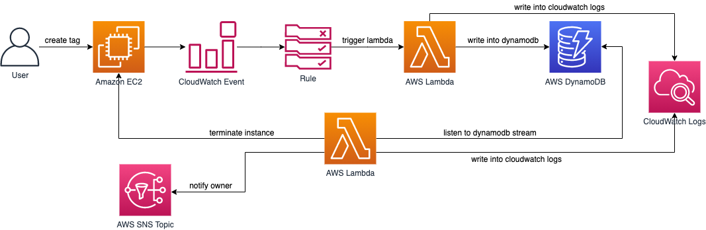
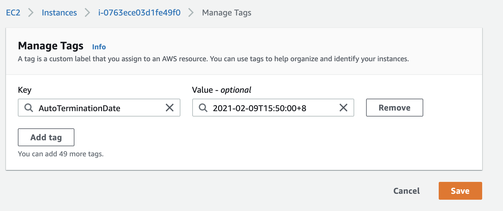
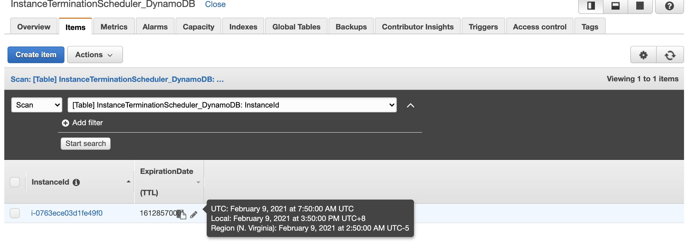
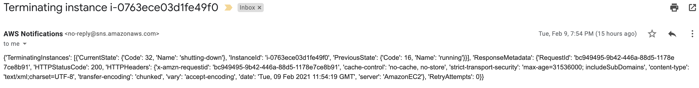

# Instance Termination Scheduler Solution
As per requested from [this](https://nijira.natinst.com/browse/CLOUD-298) task and Wayne Milam, it would be nice to design a utility we can deploy to user accounts so that EC2 instances are terminated after a specific date.  This would probably be driven by a tag that specifies the termination date, and then a regularly executed Lambda to inspect those tags and terminate the instances. Their EBS volumes should probably go with them.

To understand the requirements, we have to consider the following criteria:
1. The level of ***time precision (Precision)***, how much is it acceptable for the client? Miliseconds? Second? Minutes? Or up to hours?
2. Could there be a ***large number of open tasks*** at any time and so?
3. Could there be a ***large co-occurrence of the scheduled tasks*** that can cause scaling issues such as throttling?

## Prerequisites
Make sure you have [AWS CLI](https://docs.aws.amazon.com/cli/latest/userguide/install-cliv2.html) configured and Git installed.

Clone this repository and go to this directory:
```
git clone git@ssh.dev.azure.com:v3/ni/IT/ccoe
git checkout andy
cd ccoe/team-notes/Andy/auto-terminate-resources/version_1
```

## Architecture


As shown in the diagram, we will provision the application using Cloudformation template from this directory. The template provisions the resources as below:
1. an Amazon CloudWatch event rule which listens to event pattern of tag changing from the EC2 instances
2. an AWS Lambda which will be triggered by the CloudWatch event rule to write into DynamoDB
3. a DyanamoDB table with Time-To-Live(TTL) and DynamoDB stream enabled
4. an AWS Lambda which will listens to DynamoDB stream and terminate the instance based on the event 
5. a SNS Topic which will notify the user once an terminating action is done on the aforementioned Lambda. 

## Deployment
The solution is written in AWS Cloudformation template and should take around 2 minutes to complete the deployment. To deploy the solution, follow the steps below:

### Unix/Linux User
Change the permission of the bash file `deploy.sh` to executable:

```
$ chmod +x ./deploy.sh
```
Then run the `deploy.sh` with the parameters below:
```
./deploy.sh {S3_BUCKET} {STACK_NAME} {EMAIL} {REGION}
```
Make sure the S3 bucket and region are the same.

### Windows User
Run `aws cloudformation package` to package the local artifacts and push to your S3 bucket:
```
aws cloudformation pacakge --template-file template.yaml --s3-bucket {YOUR_S3_BUCKET} --output-template-file packaged-template.yaml
```
Run `aws cloudformation deploy` to deploy the packaged template by creating and executing a changeset, note that region will be your AWS CLI default region if region is not set:
```
aws cloudformation create-stack --template-body {PATH_TO_FILE}packaged-template.yaml --stack-name {STACK_NAME} --capabilities CAPABILITY_IAM --parameters ParameterKey=EmailToSend,ParameterValue={EMAIL} --region {REGION}
```

## Usage
First, confirm your subscription to SNS topic in your email after the deployment.

At this stage, only support ISO date format in tag value, such as `2021-02-01T00:00:00+8`. For further information about ISO format, refer to [ this website](https://www.w3.org/TR/NOTE-datetime). First, to add the tag into an instance, you can choose to either use AWS CLI or console, for demo purpose, we will be using AWS console. 

In the AWS Console, go to EC2 consle, launch an instance and add a tag with key of `AutoTerminationDate` and value of date in ISO format. 



Then check your DynamoDB table. You will see an item with instance id and date in EPOCH timestamp format in the table. Move your cursor onto the timestamp of the item and you will see the actual date in UTC, local and region. 


Next, within 48 hours after expiration of the item, the expired item will be deleted and the event will be sent into DynamoDB stream and thus captured by a Lambda function. Then, the Lambda funciton will terminate the instance and notify the owner through the email provided by the owner during deployment. You will receive a similar notification from your email.



Before expiration of the item, you are able to update the termination date or cancel the termination of the instance. 
- To udpate the termination date of the instance, make sure the item is not expired or deleted from the DynamoDB table. Then, update the value of tag `AutoTerminationDate` to your preferred date in ISO format. 
- To cancel the auto termination, remove the tag `AutoTerminationDate` from the instance before its termination or item expiry date.
- If you input the wrong string or number in the value of tag `AutoTerminationDate`, the solution will not work.
## Analysis
### Precision
According to the official AWS documentation, expired items are deleted within 48 hours because the scanner background process runs automatically to evaluate the expiry status of the item. Note that items that are past their expiration, but have not yet been deleted can still be updated, and successful updates to change or remove the expiration attribute will be honored. 
From [this](https://theburningmonk.com/2019/03/dynamodb-ttl-as-an-ad-hoc-scheduling-mechanism/) article, the author has made an experiment to measure the time taken or an expired item to be deleted from the table, in average, it can take up to 23 minutes from `eu-central-1` region.

### Scalability
Since the number of open tasks are translated from the number of items in DynamoDB table, this approach can goes up to million of tasks. DynamoDB can handle large throughputs (thousands of TPS) too. So this approach can also be applied to scenarios where thousands of items are scheduled per second.

When many items are deleted at the same time from the DynamoDB table, they are queued in the DynamoDB Stream. AWS also autoscales the number of shards in the stream, so as throughput increases the number of shards would go up accordingly. But, events are processed in sequence. So it can take some time for the function to process the event depending on 
- its position in the stream
- how long it takes to process each event.

So, while this approach can scale to support many tasks all expiring at the same time, it cannot guarantee that tasks are executed on time.

## Cost Estimation

In this solution, we have two Lambdas, one DynamoDB table, one SNS topic. Assume there will be 1 million requests per month per user in region `us-east-1`. Then,

Lambda 
- 128MB each
- $0.20 per 1M requests x2 
- around 243ms-300ms per requests x2
- total compute (seconds) = 1M*0.3sec = 300,000 seconds x2 = 600,000s
- total compute (GB/s) = 37,500GB/s = 75,000GB/s
- first 400,000 free-tier/s, assum no free-tier, charge $0.0000166667 per GB/s thereafter => $1.25
- total $1.45 per 1M requests

SNS 
- first 1M requests per month are free, $0.50 per 1M requests thereafter
- first 1000 email notifications per month are free, $2 per 100K notifications => $20 per 1M requests thereafter
- total $20.50 per 1M requests and notifications

DynamoDB
-  5 WCU => approximately $2.34 per month
-  5 RCU => approximately $0.48 per month
- DynamoDB streams: first 2,500,000 DynamoDB Streams read request units are free, assume not free, $0.02 per 100,000 DynamoDB Streams read request units thereafter => $0.2 per 1M DynamoDB streams
- Data storage: first 25 GB stored per month is free, $0.25 per GB-month thereafter, the item payload is so small that it should be okay for the first 25GB
- total $3.04 per month

Total: ~ $25 per month
## Cleanup
To clean up the solution, run the command below:
```
aws cloudformation deploy --stack-name {STACK_NAME} --region {REGION}
```
## Pros and Tradeoff
With this approach, several advantages can be found:
1. The solution can scale very well
2. User able to see the scheduling tasks and update the termination date before the instance is terminated
3. DynamoDB TTL can stay up to 5 years


For this solution, there is one major tradeoff, which is the DynamoDB TTL time precision. It is poor as AWS only states that expired items will only be cleaned up within 48 hours after it is expired, making it a bad fit for many use cases. To solve this problem, there could be an alternative, which is ***incorporating the DynamoDB TTL with Step Function***. By expiring the item up to 48 hours before the expiration date set by the user, then pass the payload to step function and thus wait until the expiration date, then terminate the instance. By this method, time precision is satisfied.


## Reference
1. [DynamoDB TTL](https://docs.aws.amazon.com/amazondynamodb/latest/developerguide/howitworks-ttl.html#:~:text=TTL%20typically%20deletes%20expired%20items,you%20must%20filter%20them%20out.)
2. [DynamoDB TTL ad hoc scheduling](https://theburningmonk.com/2019/03/dynamodb-ttl-as-an-ad-hoc-scheduling-mechanism/)
3. [Manning](https://livebook.manning.com/book/serverless-architectures-on-aws-second-edition/chapter-7/v-6/116)

