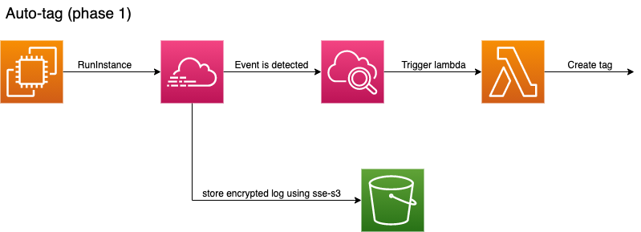

# Automatically Tag New Resources

## Architecture

## Workflow 

Workflow steps
1. A user creates Amazon Elastic Compute Cloud (Amazon EC2) instances.
2. AWS CloudTrail logs a resource creation API event.
3. A CloudWatch event rule monitors and is triggered upon the creation of events like RunInstances.
4. The CloudWatch event rule detects an applicable event, and then invokes a Lambda function to tag the resources.
5. Lambda retrieves the required tags from Parameter Store and tags the new resource.

## Advantage 
- Automatically tag resources when new resources are launched
- Enforce tagging policy by easing developer job to put in the tag, and this leads to easier 

## Disadvantage 
- Only tag newly created resource after this stack is launched
- CloudWatch event/AWS Eventbridge is a regional resource. May need to deploy the solution in every AWS resource
- Cloudtrail's response size is limited to 500kb. If launch large instance with one API call, Lambda function will not be able to tag the instances 

## Resource
- [Enforce tagging compliance](https://aws.amazon.com/blogs/apn/enforce-centralized-tag-compliance-using-aws-service-catalog-amazon-dynamodb-aws-lambda-and-amazon-cloudwatch-events/)
- [Resource auto tagger](https://blog.doit-intl.com/automatically-tag-aws-ec2-instances-and-volumes-753dcaa7d7b0)